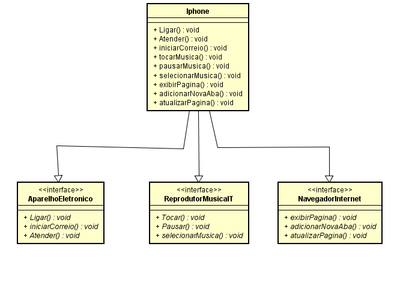

## 📱 Diagramação de classes do iPhone

## 📋 Descrição
Neste projeto, foi realizado uma implementação de um diagrama UML representando interfaces de um iphone. Desta forma, foi possível aplicar o conhecimento adquirido de POO e abstração.

## 📊 Diagrama UML

  
